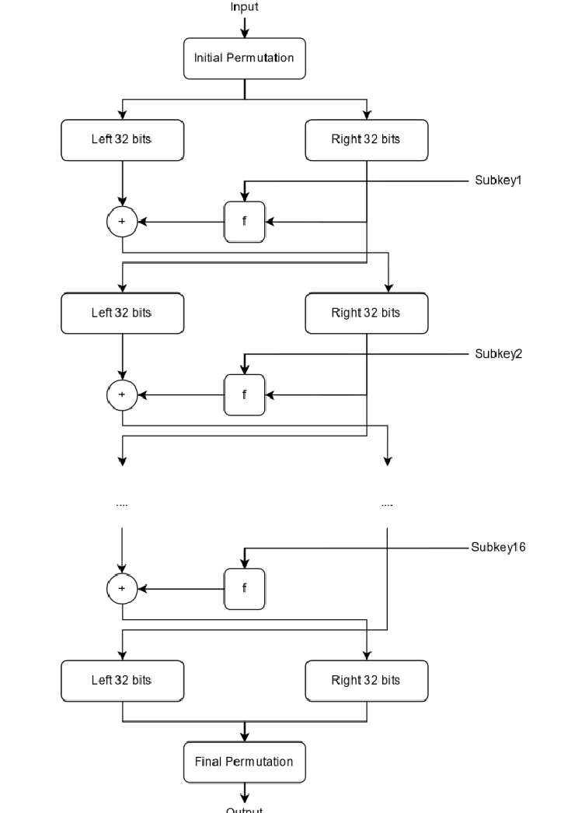

Security is important in every field. Security has become a major concern in today's world. We don't think about how secure our data is over the network and between the users. But, it has a complex mechanism to provide security. Let's see how this security mechanism is achieved. 

Cryptography is the division of computer science which is used to implement the security mechanism. It is the science of protecting information by transforming it into a secure format for protecting digital data. Cryptography focuses on transforming data into formats that cannot be recognized by unauthorized users. One of the most popular algorithms that is used in cryptography is the DES algorithm.

Before getting into the DES algorithm we should know about block ciphers. Block cipher is a deterministic algorithm operating on a fixed length group of bits called blocks. It uses a symmetric key. The basic process is that a block of plaintext undergoes an encryption process using encryption key to form a block of ciphertext of the same size. The choice of block size does not directly affect the strength of the encryption scheme. The strength of the cipher depends on the key length. A multitude of operation modes have been designed to allow their repeated use in a secure way to achieve the security goals of confidentiality and authenticity. A secure block cipher is suitable for the encryption of only a single block of data at a time, using a fixed key.

Data Encryption Standard (DES) is not vulnerable against very powerful attacks and therefore, the DES is popular. DES is a block cipher, and encrypts data in blocks of size of 64 bits each, meaning 64 bits of plaintext goes as the input to DES, which produces 64 bits of ciphertext. The same algorithm and key are used for encryption and decryption, with some minor differences. The key length is 56 bits.  The discarding of every 8th bit of the key produces a 56-bit key from the original 64-bit key.
DES is based on the two fundamental attributes of cryptography: substitution (also called confusion) and transposition (also called diffusion). DES consists of 16 steps, each of which is called a round. Each round performs the steps of substitution and transposition. The steps followed to encrypt the message are listed below:
1. In the first step, the 64 bit plain text block is handed over to an Initial Permutation (IP) function.
2. The initial permutation is performed on plain text.
3. Next, the initial permutation (IP) produces two halves of the permuted block; namely Left Plain Text (LPT) and Right Plain Text (RPT).
4. Now each LPT and RPT go through 16 rounds of encryption.
5. In the end, LPT and RPT are rejoined and a Final Permutation (FP) is performed on the combined block.
6. The result of this process produces 64 bit ciphertext.

IP is the operation in which the bits are replaced by respective bits according to the IP table.  After IP step is done, the permuted text is divided into two blocks. Each half block consists of 32 bits, and each of the 16 rounds, in turn, consists of the broad level steps listed below:
1. Key transformation
2. Expansion permutation
3. S box permutation
4. P box permutation
5. XOR and swap

Each step use tables to perform the operation. Each round is performed by using a feistel structure. Feistel structure has a fielstel function which is basic XOR operation. In each round of DES, a key is used that is formed by using key construction algorithm. After the cipher text is formed, it is sent to the receiver and the receiver  needs to decrypt the cipher text to read the message sent by the sender. DES decryption also follows the same steps as encryption but the key used in the first round is the key used in the last round of encryption. 

As the growth in the society where automated information resources are increased cryptography will continue to rise in importance as part of security mechanisms. The applications will need improved methods for access control and data security. DES is now considered insecure for some applications. According to the analytics, DES has theoretical weakness in the cipher. So it is important to add a new level of security to make the algorithm applicable. DES with two keys instead of one key will increase the efficiency of cryptography and which is already built. We need to add more complexity to the algorithm to make it more secure and efficient. Cryptography is an important and the most exciting field to work on in the world of computer science.   
 
 
Source: Internet

